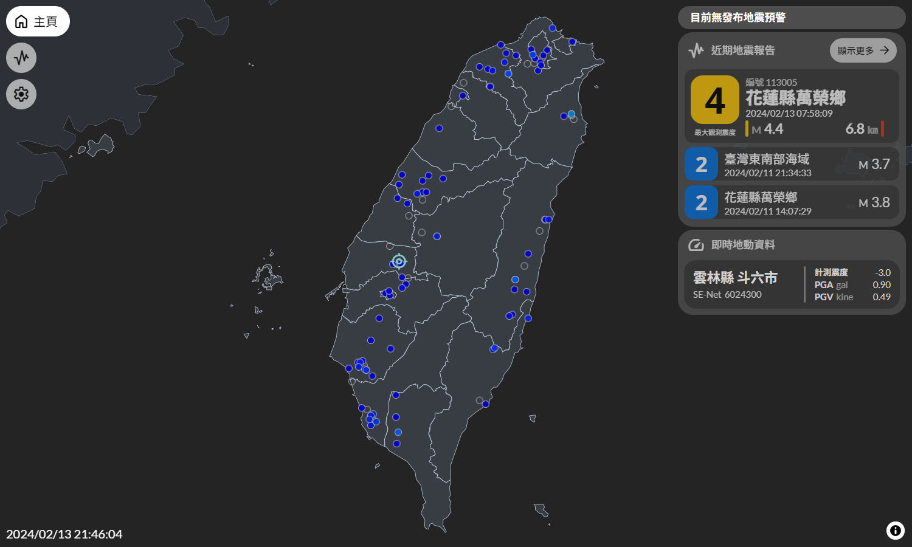
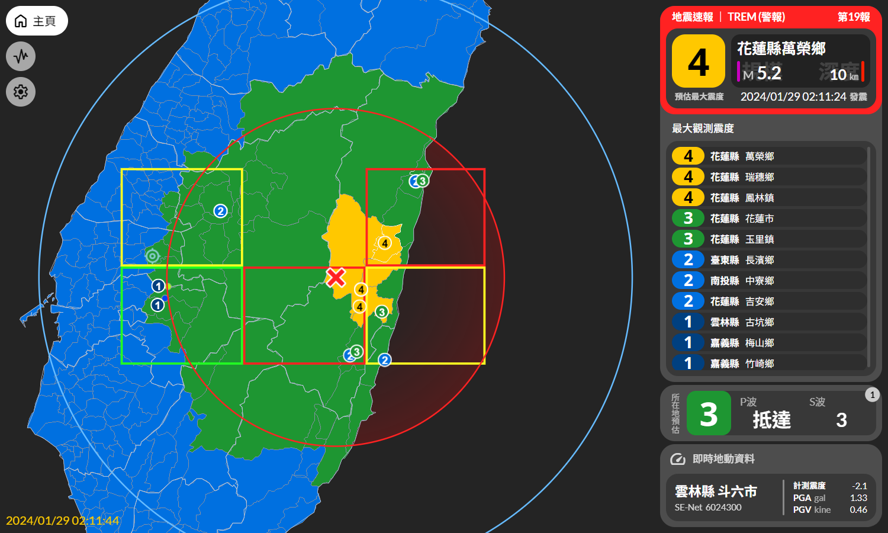
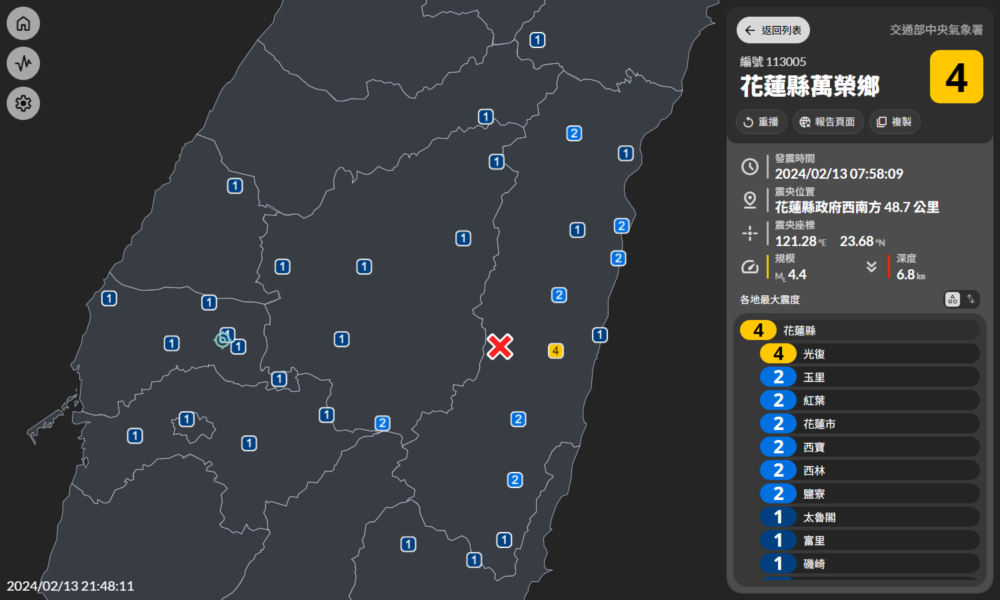

# Taiwan Real-time Earthquake Monitoring
臺灣即時地震監測

<br />

<div align="center" style="display: grid; grid-template-columns: 1fr 1fr;">



</div>

<br />

<div align="center">
  
  <a href="https://github.com/ExpTechTW/TREM-tauri/releases/latest"></a>
  <a href="https://github.com/ExpTechTW/TREM-tauri/releases/latest"></a>
  <a href="https://github.com/ExpTechTW/TREM-tauri/actions/workflows/build.yml"></a>
  <a href="https://discord.gg/exptech-studio"></a>
</div>

## 關於 TREM

TREM 是一款開源地震速報軟體，提供給您即時的地震資訊，利用自製的測站，顯示各地的即時震度，在地震發生的第一時間取得各管道發布的強震即時警報訊息

## 強震即時警報來源

* [交通部中央氣象署](https://www.cwa.gov.tw/)

## 注意事項

1. 使用過程中，請務必謹慎閱讀提示和注意事項
2. 即時測站資訊僅供參考，**實際請以中央氣象署的資料為主**
3. 此軟體僅供研究、學術及教育用途（不得營利），使用時需自行接受相關風險
4. 任何不被官方所認可的行為均有可能被列入伺服器黑名單中，請務必遵守相關規範
5. 此程式為免費開源程式，不保證能永久營運

## 從原始碼編譯

- 點擊右上角的 Code 按鈕後點擊 Download ZIP ，或是使用 `git clone` 指令來複製一份原始碼
- 系統設置
  - Windows
    - 安裝 Microsoft Visual Studio C++ Build Tools
    - 安裝 [WebView2](https://developer.microsoft.com/en-us/microsoft-edge/webview2/#download-section) (Windows 11 內建自帶可以跳過這一步驟) 
    - 安裝 [Rust](https://www.rust-lang.org/tools/install)
  - MacOS
    - 安裝 CLang 和 macOS 開發依賴 `xcode-select --install`
    - 安裝 Rust `curl --proto '=https' --tlsv1.2 https://sh.rustup.rs -sSf | sh`
  - Linux
    - 安裝系統依賴
      ```bash
      sudo apt update
      sudo apt install libwebkit2gtk-4.0-dev \
          build-essential \
          curl \
          wget \
          file \
          libssl-dev \
          libgtk-3-dev \
          libayatana-appindicator3-dev \
          librsvg2-dev
      ```
    - 安裝 Rust `curl --proto '=https' --tlsv1.2 https://sh.rustup.rs -sSf | sh`
- 執行 `npm i` 下載 TREM-tauri 依賴
- 執行 `npm run tauri build` 編譯

## 開源許可證

開源許可證資訊請詳見 [LICENSE](LICENSE) 檔案
